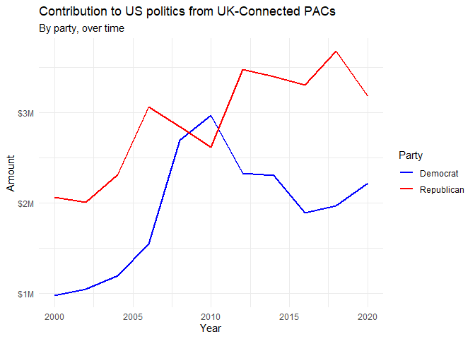

```{r setup, include=FALSE}
library(tidyverse)
library(robotstxt)
library(rvest)
library(here) 

knitr::opts_chunk$set(out.width = "100%", eval = TRUE)
```

```{r unsplash, fig.margin = TRUE, echo = FALSE, eval=FALSE}
knitr::include_graphics("img/lego-grad-cap.jpg")
```

In this assignment you will work on data scraping.
Having worked through the interactive tutorial titled [Money in politics](https://minecr.shinyapps.io/dsbox-05-moneyinpolitics/) will be a good preparation for this homework assignment as you'll be working with the same website.

Click [here](https://idsed.digital/troubleshoot/setup/openingaproject/) for a workflow overview.

## Packages

In this assignment we will use the following packages:

-   **tidyverse**: a collection of packages for doing data analysis in a "tidy" way
-   **robotstxt**: provides functions to download and parse `robots.txt` files, making it easy to check if bots (spiders, crawler, scrapers, ...) are allowed to access specific resources on a domain
-   **rvest**: helps you scrape information from web pages
-   **scales**: provides the internal scaling infrastructure used by ggplot2 and gives you tools to override the default breaks, labels, transformations and palettes

## Data collection via web scraping

```{r opensecrets, eval=TRUE, echo=FALSE, fig.margin = TRUE}
knitr::include_graphics("img/opensecrets.png")
```

The data come from [OpenSecrets.org](https://www.opensecrets.org), a *"website tracking the influence of money on U.S. politics, and how that money affects policy and citizens' lives"*.
This website is hosted by The Center for Responsive Politics, which is a nonpartisan, independent nonprofit that *"tracks money in U.S. politics and its effect on elections and public policy."*[^1]

Before getting started, let's check that a bot has permissions to access pages on this domain.

```{r paths-allowed, eval=TRUE, warning=FALSE, message=FALSE}
library(robotstxt)
paths_allowed("https://www.opensecrets.org")
```

Our goal is to scrape data for contributions in all election years Open Secrets has data for.
Since that means repeating a task many times, let's first write a function that works on the first page.
Confirm it works on a few others.
Then iterate it over pages for all years.

```{marginfigure}
__Hint:__ You can test your function by defining the URLs for 2020, 2018, and 1998 contributions and using these URLs as inputs. Use this to check the function does what you expected it to do.
```

1.  Complete writing the function called `scrape_pac()` below that scrapes information from the Open Secrets webpage for foreign-contected PAC contributions in a given year.
    This function should...

    ...have one input: the URL of the webpage and should return a data frame.

    ...rename variables scraped, using `snake_case` naming.

    ...clean up the `Country of Origin/Parent Company` variable with `str_squish()`.

    ...add a new column to the data frame for `year`.
    We will want this information when we ultimately have data from all years, so this is a good time to keep track of it.
    Our function doesn't take a year argument, but the year is embedded in the URL, so we can extract it out of there, and add it as a new column.
    Use the `str_sub()` function to extract the last 4 characters from the URL.
    You will probably want to look at the help for this function to figure out how to specify "last 4 characters".

2.  Construct a vector called `urls` that contains the URLs for each webpage that contains information on foreign-connected PAC contributions for a given year.

    Map the `scrape_pac()` function over `urls` in a way that will result in a data frame called `pac_all`.
    Then write the data frame to a csv file called `pac_all.csv` in the `data` folder.

🧶✅⬆️ *If you haven't yet done so, now is definitely a good time to knit, commit, and push your changes to GitHub with an appropriate commit message (e.g. "Data scraping complete"). Make sure to commit and push all changed files so that your Git pane is cleared up afterwards.*

## Data cleaning

In this section we clean the `pac_all` data frame to prepare it for analysis and visualization.
We have two goals in data cleaning:

-   Separate the `country_parent` into two such that country and parent company appear in different columns for country-level analysis.

-   Convert contribution amounts in `total`, `dems`, and `repubs` from character strings to numeric values.

The following exercises walk you through how to make these fixes to the data.

```{marginfigure}
__Note:__ If you can't get the webscraping section above working, a `pac_all_backup.csv` already exists in your repository for you to work on.
```

1.  In your R Markdown file, load `pac_all.csv` and report its number of observations and variables as a full sentence.

```{marginfigure}
__Hint:__ Country and parent company names are separated by `/`, with some entries having two `/` (we want to split at the first `/`).
    This can be accomplished by setting the `extra` argument in `separate` to `"merge"` so that the cell is split into only 2 segments, e.g. `"Denmark/Novo Nordisk A/S"` into `"Denmark"` and `"Novo Nordisk A/S"`.
```

1.  Use the `separate()` function to separate `country_parent` into `country` and `parent` columns. End your code chunk by printing out the top 10 rows of your data frame (if you just type the data frame name it should automatically do this for you).

```{marginfigure}
__Hint:__ The `$` character is a special character so it will need to be escaped. Also some contribution amounts are in the millions (e.g. Anheuser-Busch contributed a total of \$1,510,897 in 2008).
    In this case we need to remove all occurrences of `,`, which we can do by using `str_remove_all()` instead of `str_remove()`.
```

1.  Remove the character strings including `$` and `,` signs in the `total`, `dems`, and `repubs` columns and convert these columns to numeric. End your code chunk by printing out the top 10 rows of your data frame (if you just type the data frame name it should automatically do this for you).

🧶 ✅ ⬆️ *Now is a good time to knit your document, and commit and push your changes to GitHub with an appropriate commit message. Make sure to commit and push all changed files so that your Git pane is cleared up afterwards.*

## Data visualization and interpretation

```{marginfigure}
__Hint:__ You can calculate the sum of total contributions from PACs for each year for each country by using a sequence of `group_by()` then `summarise()`. You can make a plot of total contributions (y-axis) by year (x-axis) where two lines identified by different colours represent each of Canada and Mexico (similar to the plot in the next question).
```

1.  Create a line plot of total contributions from all foreign-connected PACs in the Canada and Mexico over the years. Once you have made the plot, write a brief interpretation of what the graph reveals.

```{marginfigure}
__Hint:__ These are only UK contributions. You will need to make use of functions from the **scales** package for axis labels as well as from **ggplot2**.
```

1.  Recreate the following visualisation. Write a brief interpretation of what the graph reveals.

```{r echo=FALSE, out.width="100%", fig.fullwidth = TRUE}

```

```{marginfigure}
__IMPORTANT: How do we mark assignments?__

Your teaching team will mark your work using your __knitted file__ (ending in .html or .md) and not your R Markdown (.Rmd) file that you use to create and run your code. This is because your knitted file is a completely _reproducible_ document where we can see your code and its output without having to run any code ourselves. It is important you knit your work while working on your assessments as we will only mark what is in the knitted file and not what is in the .Rmd file.
```

🧶 ✅ ⬆️ *Now is a good time to knit your document, commit, and then push your changes to GitHub with an appropriate commit message. Make sure to commit and push all changed files so that your Git pane is cleared up afterwards. Make sure that your last push to the repo comes before the deadline, **11 November, 16:00 UK time**. You can confirm that what you committed and pushed are indeed in your repo that we will see by visiting your repo on GitHub. Make sure your Rmd and md files are there and that your md file contains all of your code and plots!*

## Getting help

If you have any questions about the assignment, please post them on Piazza and/or stop by student hours!

[^1]: Source: [Open Secrets - About](https://www.opensecrets.org/about/).
